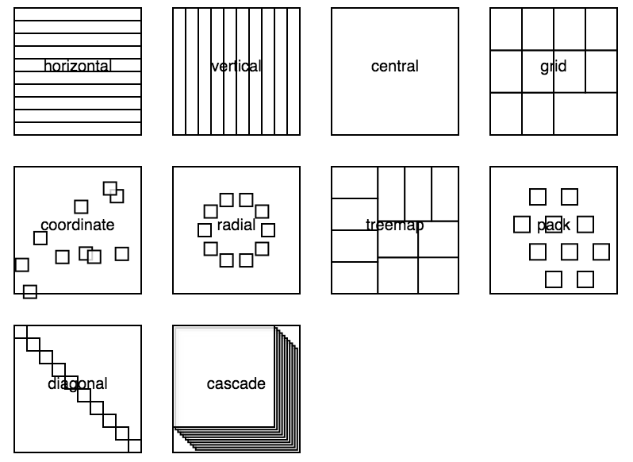
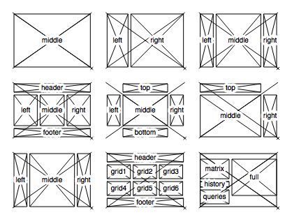

# d3-gridding

[](https://badge.fury.io/js/d3-gridding)
[](https://circleci.com/gh/romsson/d3-gridding)
[](https://david-dm.org/romsson/d3-gridding)

Rapid mock-ups for D3 charts, using data-driven grids.

<p align="center">
  <table style="border: none;">
    <tr>
      <td>
        <a href="https://romsson.github.io/d3-gridding/example/modes.html">
          
        </a>
      </td><td>
        <a href="https://romsson.github.io/d3-gridding/example/layout-all.html">
          
        </a>
      </td>
    </tr>
  </table>
</p>

*Left: grids available in the toolkits; Right: layouts for page partition to nest grids within*

## Example

```js
<!DOCTYPE html>
<meta charset="utf-8">
<body>
<script src="http://d3js.org/d3.v4.js"></script>
<script src="http://romsson.github.io/d3-gridding/build/d3-gridding.js"></script>
<script>

var width = 400,
    height = 300;

var gridding = d3.gridding()
  .size([width, height])
  .mode("grid");

var data = d3.range(250);

var griddingData = gridding(data);

var svg = d3.select("body").append("svg")
    .attr("width", width)
    .attr("height", height);

svg.selectAll(".square")
    .data(griddingData)
  .enter().append("rect")
    .style("fill", "none")
    .style("stroke", "black")
    .attr("width", function(d) { return d.width; })
    .attr("height", function(d) { return d.height; })
    .attr("transform", function(d) { return "translate(" + d.x + "," + d.y + ")"; })
    
  </script>
</body>
```

Output below; checkout a [live coding version](http://blockbuilder.org/romsson/b7799e85c0dd52f87f1e7eeba4c4b28a).

<p align="center">
  
</p>

## More Examples

* Gallery of [examples](https://romsson.github.io/d3-gridding/example/capture/display.html)

* Simple [grid example](http://blockbuilder.org/romsson/a2e9ff5f7dafe12cc97d2cc286dad733)

* Search for [code examples](http://blockbuilder.org/search#d3modules=d3-gridding) using `d3-gridding`  on blockbuilder.org.

* List of [tutorials](tutorial/) 

## How to use it

**To install**, use NPM `npm install d3-gridding` or download the [latest release](https://github.com/romsson/d3-gridding/releases/latest). 

**To use**, include the `d3-gridding.js` JavaScript file in your HTML code.

**To include** in a webpage, use the following:

```html
<script src="http://romsson.github.io/d3-gridding/build/d3-gridding.js"></script>
```

The code snippet below lets you create dots organized as a grid:

```js
var data = d3.range(10);

var gridding = d3.gridding()
  .size([800, 600])
  .mode("vertical");

var points = svgPoints.selectAll(".point")
  .data(gridding(data));

points.enter().append("circle")
  .attr("class", "point")
  .attr("r", 10)
  .attr("transform", function(d) { return "translate(" + d.cx + "," + d.cy + ")"; });
```

The magic happens with `gridding` which turns an array of JavaScript Objects, into another array with additional attributes:

`> gridding([{}, {}, {}])`

`[▶ Object, ▶ Object, ▶ Object]`

```js
[▼ Object                    ]
    x: 0
    y: 300
    cx: 300
    cy: 300
    height: 600
    width: 266.6666666666667
```

* (`x`, `y`) the computed coordinates (which can be seen as `top` / `left` values)
* (`height`, `width`) gives the bounding box if combined with (`x`, `y`)
* (`cx`, `cy`) the center of the bounding box

It becomes interesting when changing the type of layout, which will organize the elements differently, by changing the value of the attributes above:

```js
gridding.mode("horizontal");

var points = svgPoints.selectAll(".point")
  .data(gridding(data));
```

That's pretty much what you need to know at this point to get started. Below is a list of functions that will let you customize the layouts and retrieve internal values.

Note that parameters can also be set as group, using a JSON object:

```
var gridding = d3.gridding()
  .params({
    "size": [800, 600],
    "mode": "vertical",
    "offset": function(d) { return [d.x, d.y]; }
  });
```

## API

<a name="gridding_mode" href="#gridding_mode">#</a> <i>d3.gridding()</i>.<b>mode</b>(<i>mode</i>)

The `mode` parameter sets the layout:

* [`vertical`](https://romsson.github.io/d3-gridding/example/vertical.html) - vertical partitioning of value `.valueHeight()` and vertical offset `.valueX()`
* [`horizontal`](https://romsson.github.io/d3-gridding/example/vertical.html) - horizontal partitioning of value `.valueWidth()` and vertical offset `.valueY()`
* [`central`](https://romsson.github.io/d3-gridding/example/central.html) - overlapping partitioning
* [`grid`](https://romsson.github.io/d3-gridding/example/grid.html) - classic grid partitioning
* `coordinate` - absolute position by `.valueX()` and `.valueY()`
* `radial` - circular partitioning (e.g. pie chart with uniform wedges)
* [`treemap`](https://romsson.github.io/d3-gridding/example/treemap.html)- using [d3.treemap()](https://github.com/d3/d3-hierarchy/blob/master/README.md#treemap) layout
* `pack` - using [d3.pack()](https://github.com/d3/d3-hierarchy/blob/master/README.md#pack)
* [`pyramid`](https://romsson.github.io/d3-gridding/example/pyramid.html) - centered grids overlays
* `stack` - using [d3.stack()](https://github.com/d3/d3-shape/blob/master/README.md#stacks)
* `diagonal`  - aligned on the diagonal
* `cascade` - like diagonal but with larger and overlapping cells 
* `identity` - does nothing, returns same values

To get the list of all available modes `gridding.modes()`.

<a name="gridding_sort" href="#gridding_sort">#</a> <i>d3.gridding()</i>.<b>sort</b>([<i>compare</i>])

Sets the sort function, similar to [D3's](https://github.com/d3/d3-shape/blob/master/README.md#pie_sort) and defaults to:

```js
function(a, b) { return a - b; }
```

Thus you can use D3's sorting functions such as `d3.ascending` and `d3.descending`.

<a name="gridding_value" href="#gridding_value">#</a> <i>d3.gridding()</i>.<b>value</b>([<i>accessor</i>])

Sets the value `accessor` function, similar to [D3's](https://github.com/d3/d3-shape/blob/master/README.md#pie_value) and defaults to:

```js
function value(d) { return d; }
```

<a name="gridding_value_y" href="#gridding_value_y">#</a> <i>d3.gridding()</i>.<b>valueY</b>([<i>string || accessor</i>])

The value can either be a traditional `accessor` function but for attributes this time, or the data attribute itself directly as a string:

```js
.valueY(function value(d) { return d["index"]; })
```

 or

```js
.valueY("index")
```

<a name="gridding_value_y" href="#gridding_value_y">#</a> <i>d3.gridding()</i>.<b>valueY</b>([<i>string || accessor</i>])

See `valueY()`.

<a name="gridding_padding" href="#gridding_padding">#</a> <i>d3.gridding()</i>.<b>padding</b>(<i>value</i>)

Sets the local offset between grid elements (default: 1px).

<a name="gridding_padding" href="#gridding_padding">#</a> <i>d3.gridding()</i>.<b>offset</b>(<i>value</i>)

Sets the global offset for all elements (default: 0px) as an array `[left, top]`.

<a name="gridding_padding" href="#gridding_padding">#</a> <i>d3.gridding()</i>.<b>orient</b>(<i>"up" | "down" (default)</i>)

Orients the `grid` & `diagonal` layouts either upwards or downwards when adding / removing cells.

<a name="gridding_radius" href="#gridding_radius">#</a> <i>d3.gridding()</i>.<b>radius</b>(<i>value</i>)

Radius for radial layout.

## Credits

* https://d3js.org/
* http://bl.ocks.org/mbostock
* https://github.com/interactivethings/d3-grid
* http://blockbuilder.org/
